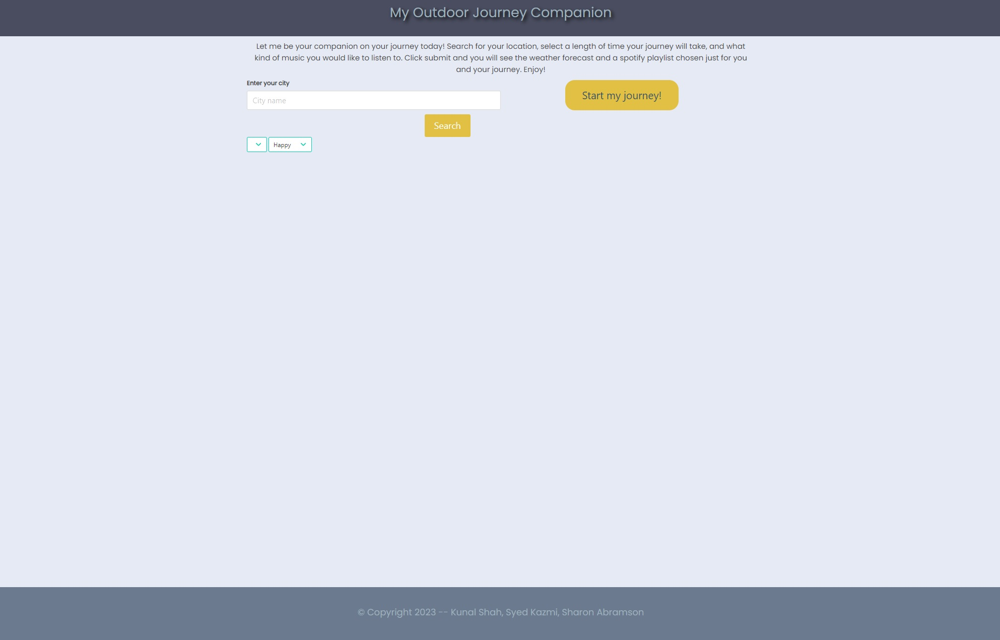
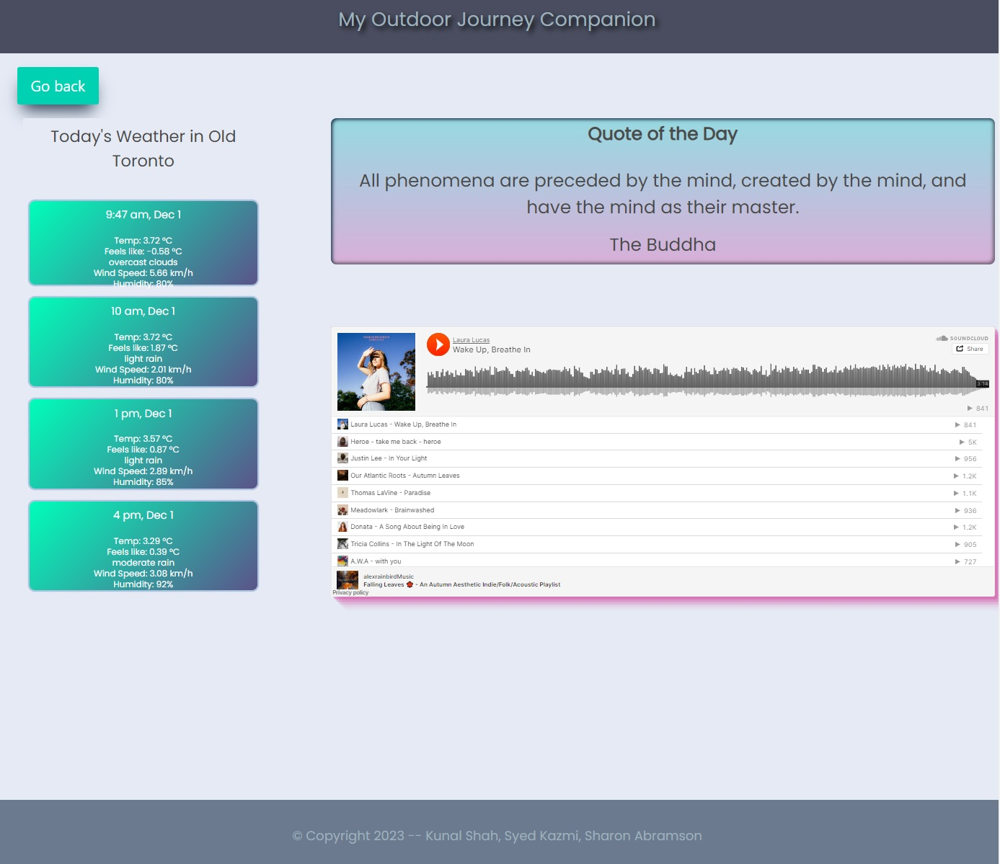

# My Outdoor Journey Companion

The Outdoor Journey Companion web application was desgined to assist a user's outdoor activities by providing the most relevant information all on a single page. This includes the current and subsequent weather conditions, mood-based music playlist, and a quote of the day to provide inspiration.

At start, the user will choose and submit their location and music preference. Following this, the application will transition them to the display screen where all relevant items will be displayed.

## Features

- user-friendly layout, 3-tile grid, one for each relevant information.
- city search fields and a button that will provide multiple options, incase of similarly named cities
- dropdown to obtain user's entertainment preference
- Current time shown on the sidebar
- Current and subsequent weather conditions showing also in the sidebar
- quote-of-the-day section on top, so the user will first read for some motivation before starting their journey.
- mood-based music playlist, in connection with SoundCloud library
- go-back button to leave current display and restart from the search display screen.

## API Reference

Server-Side APIs

#### Quotable API

```http
  (https://docs.quotable.io/docs/api/ZG9jOjQ2NDA2-introduction)
```

| Endpoint | Parameter   | Description                   |
| :------- | :---------- | :---------------------------- |
| `random` | `maxLength` | random quote of max 120 words |

#### OpenWeatherMap API

```http
  (https://openweathermap.org/api)
```

| Endpoint  | Parameter                | Description                           |
| :-------- | :----------------------- | :------------------------------------ |
| `direct`  | `cityName, limit, appid` | get city long and lat coordinates     |
| `weather` | `units, long-lat, appid` | current weather conditions of a city  |
| `forcast` | `units, long-lat, appid` | upcoming conditions, 3-hour intervals |

#### SoundCloud API

```http
  (https://developers.soundcloud.com/docs/api/html5-widget)
```

| Endpoint   | Parameter                 | Description                                   |
| :--------- | :------------------------ | :-------------------------------------------- |
| `playlist` | `playlist-number, widget` | displays a chosen playlist widget on the page |

###

Third-Party APIs

#### Bulma CSS Styling API (https://bulma.io/)

Free, open-source framework providing ready-to-use and responsive frontend components.

#### Google Fonts https://fonts.google.com/)

Stylized, open-source computer font and web font service owned by Google.

#### Day.js (https://day.js.org/)

JavaScript Library: Parses, validates, manipulates, and displays dates and times.

#### jQuery (https://api.jquery.com/)

JavaScript Library: makes DOM traversal, manipulation, event handling, and animation much simpler, works across multiple browsers.

## Roadmap

- Google Calander connectivity to log previous activities

- SoundCloud user authentication to access preferences and search large entertainment library

## Authors

- [Sharon Abramson](HTML, CSS)

- [Syed Kazmi](Quotable, OpenWeatherMap)

- [Kunal Shah](SoundCloud, Spotify)

## Deployment

Website URL

```bash
  (https://sabramson16.github.io/Proj1.Outdoor-Companion/)
```

GitHub Repository

```bash
  https://github.com/SAbramson16/Proj1.Outdoor-Companion
```

GitHub Project

```bash
  https://github.com/users/SAbramson16/projects/1

```

## Demo

User Start Screen - demo



User Display Screen - demo


